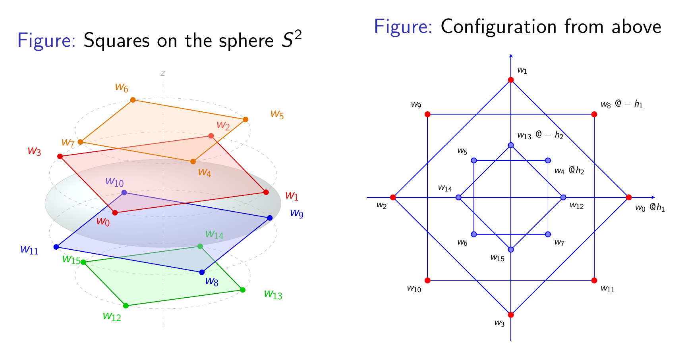

# A Spurious Minimum for the Logarithmic Fekete Problem on $S^2$

We present a computer-assisted proof of the existence of a spurious minimum for the logarithmic Fekete problem on $S^2$. Although numerical evidence suggests that the number of spurious local minima of this problem increases dramatically with the number of points on the sphere, no formal proof for their existence on $S^2$ was known until now.

Our configuration consists of 16 points on the sphere, placed at the vertices of four squares at parallel planes of different heights, with 45 degrees of phase between adjacent squares.

Our method relies on block diagonalizing the Hessian matrix of the optimization problem by means of linear representations of the group of symmetries of the critical configuration, and then classifying the configuration by using Gröbner bases and interval arithmetic to determine the sign of the eigenvalues of each block.

See the [presentation](albatross_presented.pdf) at [Albatross](https://albatross-2026.sciencesconf.org/) for more details. (to download the presentation: click the pdf and then click the "Download raw file" icon.)

The code and a preprint at arXiv will be available soon.

## Acknowledgments

* ANII and CAP for PhD grants.
* msolve, Macaulay2 and SymPy developers for their great work.
